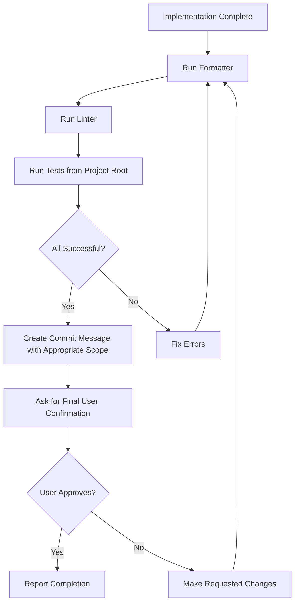

# Technical Context: egraph-rs

## Technologies Used

### Core Technologies

- **Rust (2021 Edition)**: Primary implementation language
- **Cargo**: Build system and package manager
- **WebAssembly/wasm-bindgen**: For JavaScript integration
- **PyO3**: For Python bindings

### Development Tools

- **cargo fmt**: Code formatting
- **cargo clippy**: Linting and static analysis
- **cargo test**: Testing framework
- **npm/Node.js**: For JavaScript-related development
- **prettier**: For JavaScript/TypeScript formatting

## Quick Reference

### Frequently Used Commands

| Function                    | Command                                                                                                            |
| --------------------------- | ------------------------------------------------------------------------------------------------------------------ |
| **Rust: Check**             | `cargo check --workspace`                                                                                          |
| **Rust: Run All Tests**     | `cargo test --workspace`                                                                                           |
| **Rust: Run Crate Tests**   | `cargo test -p <crate-name>` (e.g., `cargo test -p petgraph-layout-mds`)                                           |
| **Rust: Run Specific Test** | `cargo test -p <crate-name> <test-name>` (e.g., `cargo test -p egraph-wasm sgd_full`)                              |
| **WASM: Run All Tests**     | `wasm-pack test --node crates/wasm`                                                                                |
| **WASM: Run Specific Test** | `wasm-pack test --node crates/wasm --test <test-name>` (e.g., `wasm-pack test --node crates/wasm --test sgd_full`) |
| **Rust: Format**            | `cargo fmt --all`                                                                                                  |
| **Rust: Lint**              | `cargo clippy --workspace --all-targets --all-features -- -D warnings`                                             |
| **JS/TS: Format**           | `npx prettier --write .`                                                                                           |
| **WASM: Build**             | `npm run wasm-build`                                                                                               |
| **Examples: Run**           | `npm start`                                                                                                        |

### Key Directories

| Directory                | Contents                        |
| ------------------------ | ------------------------------- |
| `crates/algorithm`       | Graph algorithm implementations |
| `crates/layout`          | Layout algorithms               |
| `crates/python`          | Python bindings                 |
| `crates/quality-metrics` | Drawing quality metrics         |
| `js/examples`            | JavaScript usage examples       |

## Development Setup

### Rust Development

```bash
# Check code
cargo check --workspace

# Run all tests from project root
cargo test --workspace

# Run tests for a specific crate
cargo test -p <crate-name>

# Run a specific test
cargo test -p <crate-name> <test-name>

# Format code
cargo fmt --all

# Lint code
cargo clippy --workspace --all-targets --all-features -- -D warnings
```

### WebAssembly Development

```bash
# Run all WebAssembly tests from project root
wasm-pack test --node crates/wasm

# Run specific WebAssembly test file
wasm-pack test --node crates/wasm --test <test-name>

# Build WebAssembly
npm run wasm-build
```

### JavaScript/TypeScript Development

```bash
# Format code
npx prettier --write .

# Build WebAssembly
npm run wasm-build

# Run examples
npm start
```

## Technical Constraints

1. **Cross-Language Compatibility**: Must maintain consistent behavior across Rust, Python, and JavaScript
2. **Memory Management**: Careful handling of memory for large graphs, especially in WebAssembly context
3. **Performance Requirements**: Algorithms must scale efficiently for large graph datasets
4. **API Stability**: Public interfaces should minimize breaking changes
5. **Error Handling**: Robust error handling across language boundaries

## WebAssembly Bindings Structure

The WebAssembly bindings (`crates/wasm`) provide JavaScript-friendly interfaces to the core Rust graph algorithms and visualization capabilities:

### Module Structure

- **src/lib.rs**: Entry point that exports all WASM modules with documentation of overall functionality
- **src/graph/**: Graph data structures and operations
  - **src/graph/mod.rs**: Module definition and exports
  - **src/graph/types.rs**: Common type definitions (`Node`, `Edge`, `IndexType`)
  - **src/graph/base.rs**: Base implementation shared by directed and undirected graphs
  - **src/graph/undirected.rs**: `Graph` class implementation for undirected graphs
  - **src/graph/directed.rs**: `DiGraph` class implementation for directed graphs
- **src/drawing/**: Graph drawing implementations for various geometric spaces
  - **src/drawing/drawing_euclidean_2d.rs**: 2D Cartesian coordinate drawings (`DrawingEuclidean2d`)
  - **src/drawing/drawing_hyperbolic_2d.rs**: 2D hyperbolic space drawings (`DrawingHyperbolic2d`)
  - **src/drawing/drawing_spherical_2d.rs**: Spherical surface drawings (`DrawingSpherical2d`)
  - **src/drawing/drawing_torus_2d.rs**: Torus surface drawings (`DrawingTorus2d`)
  - **src/drawing/drawing_euclidean.rs**: N-dimensional Euclidean space drawings
- **src/layout/**: Layout algorithms for positioning graph nodes
  - **src/layout/kamada_kawai.rs**: Force-directed layout using Kamada-Kawai algorithm
  - **src/layout/mds.rs**: Multidimensional scaling implementations
  - **src/layout/stress_majorization.rs**: Stress majorization algorithm
  - **src/layout/overwrap_removal.rs**: Node overlap removal algorithm
  - **src/layout/sgd/**: Stochastic gradient descent implementations
- **src/edge_bundling.rs**: Force-directed edge bundling for reducing visual clutter
- **src/clustering.rs**: Graph clustering and coarsening for simplifying complex graphs
- **src/quality_metrics.rs**: Metrics for evaluating layout quality (stress, crossing number, etc.)
- **src/rng.rs**: Random number generation with seed control for reproducible layouts

### JavaScript API Features

The WASM module provides JavaScript-friendly interfaces with these key characteristics:

- **Consistent naming**: Uses camelCase for method names in JavaScript (e.g., `addNode`, `removeEdge`)
- **JSDoc-style comments**: Function documentation includes parameter and return type information
- **Transparent data handling**: Allows passing JavaScript values as node and edge data
- **Memory safety**: Handles conversion between Rust and JavaScript types safely
- **Method chaining**: Where appropriate, methods return the object for chaining operations
- **Error handling**: Methods that can fail return Results that become JavaScript exceptions
- **Callback support**: Many algorithms accept JavaScript callback functions for customization

### Usage Example

```javascript
// Creating a graph and drawing
const graph = new Graph();
const nodeA = graph.addNode({ label: "A" });
const nodeB = graph.addNode({ label: "B" });
graph.addEdge(nodeA, nodeB, { weight: 1.5 });

// Creating a drawing and applying a layout
const drawing = DrawingEuclidean2d.initialPlacement(graph);
const layout = new KamadaKawai(graph, (e) => ({ distance: 1.0 }));
layout.run(drawing);

// Accessing node positions
console.log(`Node A position: (${drawing.x(nodeA)}, ${drawing.y(nodeA)})`);
```

## Dependencies

### Rust Dependencies

- Added per crate in respective `Cargo.toml` files
- Each crate should minimize dependencies to what is absolutely necessary

### JavaScript Dependencies

- Managed through npm workspaces
- Installation via `npm install <package-name> -w <workspace-name>`

## Build & Deployment Processes

### Rust Crates

- Built with standard Cargo workflow
- Documentation generated with rustdoc

### WebAssembly

- Custom build script in `crates/wasm/build.js`
- Output to `crates/wasm/dist/`

### Python Package

- Built using maturin (PyO3)
- Configured in `crates/python/pyproject.toml`

## Code Conventions

### Coding Styles

#### Rust Conventions

- **Edition:** Rust 2021 Edition
- **Formatting:** Use `rustfmt` for unified formatting
- **Linting:** Use `clippy` for static analysis and lint checking
- **Comments:**
  - Documentation comments (`///`, `//!`) for public items and modules
  - Write comments that explain the WHY, not the HOW
  - All comments must be written in English
  - Avoid unnecessary commented-out code or work-in-progress notes

#### JavaScript/TypeScript Conventions

- **Formatting:** Use `prettier` for unified formatting
- **Comments:** All comments must be in English

### Naming Conventions

- **Rust:**
  - `snake_case` for functions, methods, variables, modules
  - `CamelCase` for types, traits, enums
  - `SCREAMING_SNAKE_CASE` for constants
- **JavaScript/WebAssembly API:**
  - `camelCase` for method names in JavaScript interfaces
  - Include JSDoc-style comments for JavaScript/TypeScript developers
- **Python API:**
  - Follow PEP 8 naming conventions (`snake_case`)
  - Include proper type hints in Python documentation

### Commit Message Format

Follow the Conventional Commits format:

```
<type>(<scope>): <description>

[optional body]

[optional footer]
```

- **type**: feat, fix, docs, style, refactor, perf, test, chore
- **scope**:
  - Use workspace crate names for changes specific to a crate (e.g., petgraph-layout-mds, egraph-wasm)
  - Omit scope for project-wide changes (e.g., memory-bank updates, root configuration files)
- **description**: concise explanation of the change

Examples:

- `feat(petgraph-layout-mds): add support for high-dimensional embeddings`
- `fix(egraph-wasm): resolve NaN values in ClassicalMds implementation`
- `test(petgraph-layout-sgd): add comprehensive tests for schedulers`
- `docs(petgraph-drawing): improve API documentation`
- `refactor(petgraph-algorithm-shortest-path): optimize distance calculation`
- `docs: update project workflow guidelines` (project-wide change, no scope)

## Development Process & Guidelines

### Development Workflow

#### Before Starting a Task

1. Understand task requirements and constraints
2. Review project structure (refer to `projectbrief.md` and `systemPatterns.md`)
3. Check related code files to understand existing coding style
4. Create a mental checklist of requirements to fulfill

#### During Implementation

1. Ensure all comments are written in English
2. Ensure comments explain WHY rather than HOW
3. Follow project's formatting and style guidelines
4. Regularly test work-in-progress changes

#### Before Completing a Task

1. Run formatter and linter:
   - `cargo fmt --all`
   - `cargo clippy --workspace --all-targets --all-features -- -D warnings`
2. Run tests from the project root:
   - `cargo test --workspace` (for all tests)
   - `cargo test -p <crate-name>` (for specific crate tests)
   - For WebAssembly tests:
     - `wasm-pack test --node crates/wasm` (for all WebAssembly tests)
     - `wasm-pack test --node crates/wasm --test <test-name>` (for specific WebAssembly tests)
3. Verify all requirements have been met
4. Prepare a commit message in Conventional Commits format:
   - Use crate names as scopes for crate-specific changes
   - Omit scope for project-wide changes
5. **HIGHEST PRIORITY**: Ask for final confirmation from the user before completing the task
   - Present a summary of all changes made
   - Include the proposed commit message
   - Wait for explicit approval before marking the task as complete
   - This confirmation step must never be skipped under any circumstances

### Task Execution Process

#### Process at the Start of a Task


**Checklist at Task Start**:

- [ ] Review all Memory Bank files to understand project context
- [ ] Understand project structure from `projectbrief.md` and `systemPatterns.md`
- [ ] Check code conventions and development guidelines from `techContext.md`
- [ ] Examine related code files to understand existing implementation patterns
- [ ] Record task completion checklist as internal tasks

#### Continuous Verification During Task Execution


**Check Points During Implementation**:

- [ ] Are all comments written in English?
- [ ] Do comments explain "why" things are done this way?
- [ ] Does the code comply with the project's style guide?
- [ ] Prepare commit message draft in Conventional Commits format

#### Final Verification Before Task Completion



### Memory Bank Management

1. **When to Update Memory Bank**:

   - After implementing significant changes
   - When discovering new project patterns or best practices
   - When context needs clarification
   - When explicitly requested by the user

2. **Update Process**:
   - Review all Memory Bank files (`projectbrief.md`, `productContext.md`, `systemPatterns.md`, `techContext.md`, `activeContext.md`, `progress.md`)
   - Update current state information in `activeContext.md`
   - Record progress and status in `progress.md`
   - Document any new conventions in `techContext.md`
   - Document any architectural changes in `systemPatterns.md`
   - Keep technical documentation up-to-date in `techContext.md`

## Best Practices

1. **Dependency Management:**

   - Minimize dependencies to what is absolutely necessary
   - Consider using the latest stable version unless otherwise specified
   - Refer to library documentation for version selection

2. **Error Handling:**

   - Provide robust error handling across language boundaries
   - Prefer explicit error handling over silent failures
   - Convert Rust errors to appropriate JavaScript exceptions

3. **Performance Considerations:**

   - Optimize critical path algorithms for performance
   - Balance layout quality with computation speed
   - Be mindful of memory usage, especially in WebAssembly context

4. **API Design:**

   - Maintain consistent interfaces across language bindings
   - Public interfaces should minimize breaking changes
   - Design APIs for extensibility

5. **Documentation:**
   - Document public APIs thoroughly
   - Include examples where appropriate
   - Maintain consistent documentation style across crates
